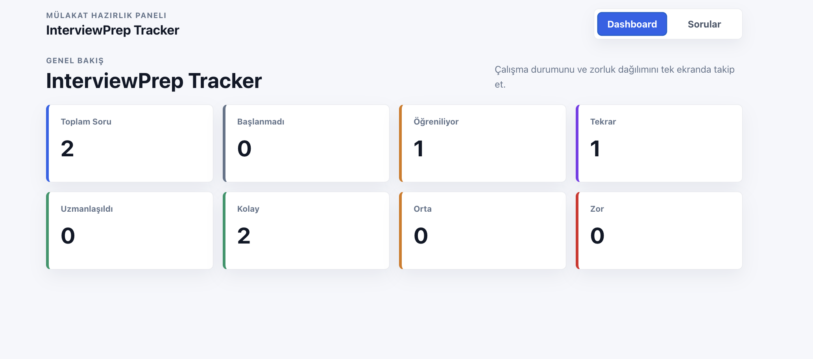
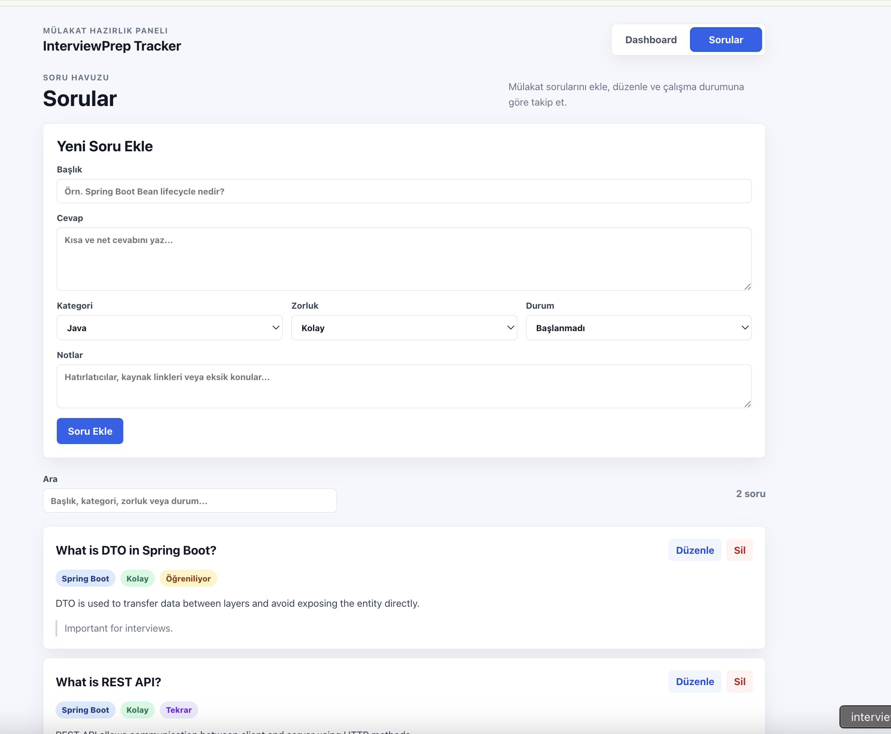
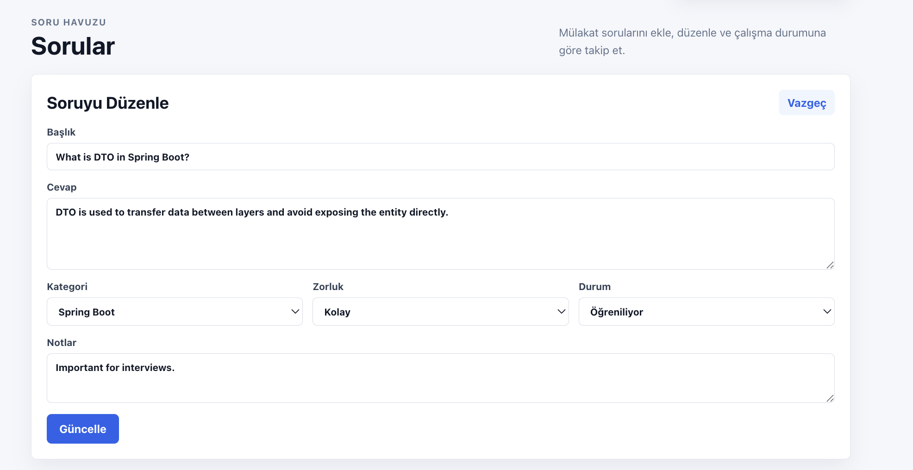
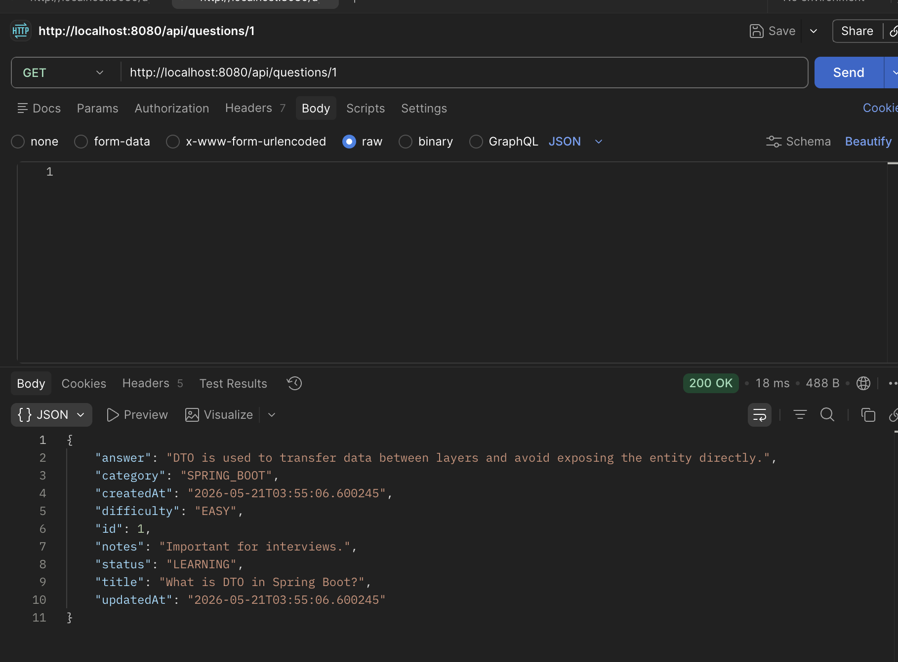

# InterviewPrep Tracker

A full-stack interview question tracker built with React, TypeScript, Spring Boot, and PostgreSQL.

InterviewPrep Tracker helps users create, list, update, and delete technical interview questions. It also provides a dashboard summary based on question status and difficulty, making it easier to track interview preparation progress across multiple topics.

Repository name: `interviewprep-tracker-react-springboot-typescript`

## Tech Stack

### Backend

- Java
- Spring Boot
- Spring Web
- Spring Data JPA
- PostgreSQL
- Lombok
- Maven

### Frontend

- React
- TypeScript
- Vite
- Axios
- CSS / clean responsive UI

## Main Features

- Create interview questions
- List interview questions
- Update interview questions
- Delete interview questions
- Track question category
- Track difficulty level
- Track learning status
- Dashboard summary cards
- PostgreSQL database persistence
- REST API integration between frontend and backend
- CORS configuration for local frontend-backend development

## Main Entity

### InterviewQuestion

- `id`
- `title`
- `answer`
- `category`
- `difficulty`
- `status`
- `notes`
- `createdAt`
- `updatedAt`

## Enums

### QuestionCategory

- `JAVA`
- `SPRING_BOOT`
- `REACT`
- `TYPESCRIPT`
- `DATABASE`
- `SYSTEM_DESIGN`
- `HR`

### Difficulty

- `EASY`
- `MEDIUM`
- `HARD`

### QuestionStatus

- `NOT_STARTED`
- `LEARNING`
- `REVIEW`
- `MASTERED`

## Backend Endpoints

### Questions

- `POST /api/questions`
- `GET /api/questions`
- `GET /api/questions/{id}`
- `PUT /api/questions/{id}`
- `DELETE /api/questions/{id}`

### Dashboard

- `GET /api/dashboard/summary`

## Project Structure

```text
interviewprep-tracker/
  backend/
    src/main/java/com/interviewprep/backend/
      controller/
      service/
      repository/
      entity/
      dto/
      enums/
      exception/
      config/
    src/main/resources/
      application-example.properties
  frontend/
    src/
      api/
      pages/
      types/
  README.md
```

## How to Run

### Backend

1. Create a PostgreSQL database:

```sql
CREATE DATABASE interviewprep_tracker_db;
```

2. Copy `application-example.properties` to `application.properties`.

```bash
cd backend/src/main/resources
cp application-example.properties application.properties
```

3. Update the database username and password in `application.properties`.

4. Run the backend:

```bash
cd backend
./mvnw spring-boot:run
```

Backend URL:

```text
http://localhost:8080
```

### Frontend

1. Install dependencies:

```bash
cd frontend
npm install
```

2. Run the frontend:

```bash
npm run dev
```

Frontend URL:

```text
http://localhost:5173
```

## Screenshots

### Dashboard


### Questions Page


### Question Update


### Dashboard Summary API Test


## Future Improvements

- Add authentication
- Add advanced filtering
- Add pagination
- Add charts
- Add tags
- Add favorite questions
- Add deployment

## Portfolio Note

This project was built as a fast MVP portfolio project to demonstrate full-stack CRUD development, REST API design, DTO usage, PostgreSQL integration, and React + TypeScript frontend integration.
